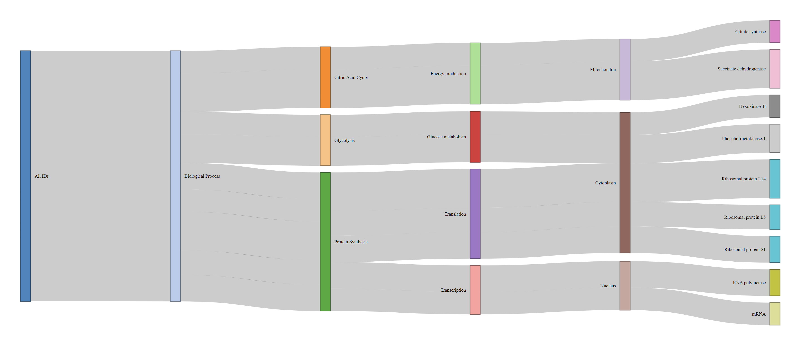

# **blastinR**
A collection of functions aimed at interfacing R and blast+ suite.
The tidyverse package should be loaded first as the functions use some tidyverse packages 
as dependencies 


* [Functions](#Functions)

* [Manual](#Manual)


```{r libs, eval=FALSE}
library("tidyverse")
```

```r
# essential for the summarize_bl function
library(networkD3)
library(htmlwidgets)
library(webshot)

```


# Functions

There are a series of functions involved in the blastinR workflow.

## **make_blast_db**

The `make_blast_db` function is a wrapper for the `makeblastdb` function from BLAST+.
It will generate all the files required for a BLAST database. 
The `infile` argument should specify the path to a fasta file containing all the sequences 
to be included in the database. The `outfile` argument should specify the names of all the
database files to be generated. All database files will carry the same name but will differ
in extension. 
* `dbtype` Default is nucl. The database type (prot, nucl)
* `taxid` The taxonomy information file. (txt file expected).

```{r mdb, eval=FALSE}
make_blast_db(infile = "PATH/TO/FILE.FASTA",outfile="my_out_file")
```


## **blstinr**

Runs BLAST+ on query against a local database specified by the user. 

* `btype` argument specifies which blast type would be used, the default is `blastn`.
* `dbase` Path or name of the blast database without including any extensions.
* `qry` Path or name of the query file. Must be fasta format.
* `taxid` Default is FALSE. False means there is no file for taxonomy id. True means that there is a file for taxonomy id that was used in make_blast_db function.
* `report` Default is TRUE. Creates report.
* `ncores` Default is two. Number of threads.
* `numt` arguments specifies the number of threads to be used, only work with UNIX based OS, default value is 1. 

Returns a dataframe with blast/query results. Will output this information in the form of an interactive table in the report. 

```{r mdb, eval=FALSE}
blastinr(btype = "blastn", dbase = "PATH/TO/DATABASE/FILES", 
qry = "PATH/TO/FASTA/FILE")
```


## **retrive_hit_seqs**

A function to retrieve hit sequences from blast search results from within R.

* `query_ids` is a vector which holds the ID of queries for which we want to retrieve their corresponding hit sequences. 
* `blast_results` parameter is the dataframe output of the blastinr function. 
* `NumHitseqs` Default is 1. The number of hits returned.
* `outfile` indicates the name and path of the output file.
* `cut_seq` Default is True. True will cut the hit sequence from start to end of match. False returns the entire sequence.
* `MultFiles` Default is false. if True, will output one file of hit sequences for each query. False places all query hits in one file. 
* `report` default parameter creates a report or adds to an existing report. 

Outputs fasta files to outfile and returns hit sequences to terminal.

```{r mdb, eval=FALSE}
retrieve_hit_seqs(query_ids, blast_results, blastdb = "PATH/TO/FASTA/FILE", 
NumHitseqs = 1, outfile= "PATH", cut_seq = TRUE,
MultFiles = FALSE, report = TRUE)
```

## **summarize_bl**

Can plot taxonomy or GO annotations. Receives metadata to annotate blast outputs. 

* `df1` The dataframe that has the added metadata. 
* `df2` dataframe outputted from blastinr function.
* `id_col` The column name that contains the ID to merge dataframes with.
* `summarize_cols` A vector that contains the names of the columns to summarize.
* `report` default parameter is TRUE. Creates a report or adds to an existing report.

Returns an interactive Sankey plot.

## **Reporting System**

A great feature of this package is its ability to keep a record of the user's interactions with all of the functions within it. Furthermore, it will include the outputs that were generated by those functions.

# Manual

A basic workflow of the program is demonstrated below. For more information about the functions used and their parameters, refer to the function documentations above.

### Database Creation

First, a local database must be made. 
In this example, spike proteins of different Coronavirus variants are used.


```r 
# Obtain sequences from GitHub
genomes_seqs <- readDNAStringSet(filepath = "https://raw.githubusercontent.com/idohatam/Biol-3315-files/main/SARS_MERS_coronavirus.raw_sequence.fasta")

# Write sequences into a fasta file
writeXStringSet(genomes_seqs, file = "spike_protein_seqs_SARS.fasta", format = "fasta")

```

After obtaining the fasta files that you wish to use as the database, use the make_blast_db function to create the database. 


```r
# create a spike protein database from the fasta file. 
make_blast_db("spike_protein_seqs_SARS.fasta",'prot',NULL,'taxid_map_internalDS.txt')

```


```
--- 2024-10-26 17:54:00.140211 ---
[1] "Blast database successfully created."  "Outfile name: spike_protein_seqs_SARS"
```

After make_blast_db function, there should be multiple files created either in the current directory or another directory specified to the function.


### Obtain Sample Data


The program is now ready to run a query against a database. The code below obtains a sample dataset to run against the local database.


```r
# obtain the sequences from GitHub
genomes_seqs <- readDNAStringSet(
  filepath = "https://raw.githubusercontent.com/idohatam/Biol-3315-files/main/SARS_MERS_coronavirus.raw_sequence.fasta")

# write sequences into a fasta file. 
writeXStringSet(genomes_seqs, file = "genomes_seqs_SARS.fasta", format = "fasta")

```
Note that the query sequences are nucleotides. This is important as it determines the type of blast that will be run against the database. 


### Run Pipeline

To run all the functions of BLASTinR. 

```{r}
Run_Blast(infile = "PATH/TO/DATABASE/FASTA/FILE", dbtype = "prot", taxids_file = "PATH/TO/TAX/ID/TXT/FILE", btype = "blastx",
          qry = "PATH/TO/QUERY/FASTA/FILE",
          taxid = TRUE, ncores = 3, query_ids = c("Camel_MERS-CoV","Bat_coronavirus","MERS_coronavirus"), retrievSeqs_outfile = "prot", df1 = df1, id_col = "ID", summarize_cols = c("", ""))

```


### BLAST Query Against Local Database

Since the database is a protein database and the query is nucleotide sequences, we will use blastx.

```r
blast_output <- blstinr('blastx','spike_protein_seqs_SARS','genomes_seqs_SARS.fasta', TRUE)
```

The output dataframe:

```
# A tibble: 123 × 14
   qseqid      sseqid pident length mismatch gapopen qstart  qend sstart  send    evalue bitscore staxids
   <chr>       <chr>   <dbl>  <int>    <int>   <int>  <int> <int>  <int> <int>     <dbl>    <dbl>   <int>
 1 Bat_corona… Bat_c…  100     1258        0       0  21578 25351     12  1269 0           2545        22
 2 Bat_corona… SARS_…   97.4   1262       29       1  21578 25351     12  1273 0           2481        55
 3 Bat_corona… SARS-…   97.0   1262       34       1  21578 25351     12  1273 0           2467        44
 4 Bat_corona… Pango…   89.7   1258      124       3  21578 25351     13  1265 0           2293        33
 5 Bat_corona… SARS_…   77.7   1246      258       6  21620 25351     28  1255 0           1988        66
 6 Bat_corona… SARS_…   77.6   1246      259       6  21620 25351     28  1255 0           1988        77
 7 Bat_corona… Camel…   34.7   1023      587      25  22331 25219    311  1312 1.82e-159    527        11
 8 Bat_corona… MERS_…   34.6   1022      589      25  22331 25219    311  1312 7.70e-159    525        99
 9 Bat_corona… MERS_…   24.2     91       50       3  16822 17049     78   164 7.9 e+  0     23.9      99
10 Bat_corona… MERS_…   34.5   1023      589      25  22331 25219    311  1312 1.91e-158    524        88
# ℹ 113 more rows
# ℹ 1 more variable: Range <int>
# ℹ Use `print(n = ...)` to see more rows
```

### Retrieve Hit Sequences From BLAST 

```r
# Retrieve ID vector
qry_ids <- c("Bat_coronavirus")

retrieve_hit_seqs(qry_ids, blast_output, "spike_protein_seqs_SARS", 6, "prot_hit_OneFile", TRUE, FALSE, FALSE)
```
The first sequence inside the "prot_hit_OneFile" output fasta file.
```
>Bat_coronavirus__queryID:Bat_coronavirus_sstart:12_send:1269_Orientation:+
SSQCVNLTTRTQLPPAYTNSSTRGVYYPDKVFRSSVLHLTQDLFLPFFSNVTWFHAIHVSGTNGIKRFDNPVLPFNDGVYFASTEKSNIIRGWIFGTTLDSKTQSLLIVNNATNVVIKVCEFQFCNDPFLGVYYHKNNKSWMESEFRVYSSANNCTFEYVSQPFLMDLEGKQGNFKNLREFVFKNIDGYFKIYSKHTPINLVRDLPPGFSALEPLVDLPIGINITRFQTLLALHRSYLTPGDSSSGWTAGAAAYYVGYLQPRTFLLKYNENGTITDAVDCALDPLSETKCTLKSFTVEKGIYQTSNFRVQPTDSIVRFPNITNLCPFGEVFNATTFASVYAWNRKRISNCVADYSVLYNSTSFSTFKCYGVSPTKLNDLCFTNVYADSFVITGDEVRQIAPGQTGKIADYNYKLPDDFTGCVIAWNSKHIDAKEGGNFNYLYRLFRKANLKPFERDISTEIYQAGSKPCNGQTGLNCYYPLYRYGFYPTDGVGHQPYRVVVLSFELLNAPATVCGPKKSTNLVKNKCVNFNFNGLTGTGVLTESNKKFLPFQQFGRDIADTTDAVRDPQTLEILDITPCSFGGVSVITPGTNASNQVAVLYQDVNCTEVPVAIHADQLTPTWRVYSTGSNVFQTRAGCLIGAEHVNNSYECDIPIGAGICASYQTQTNSRSVASQSIIAYTMSLGAENSVAYSNNSIAIPTNFTISVTTEILPVSMTKTSVDCTMYICGDSTECSNLLLQYGSFCTQLNRALTGIAVEQDKNTQEVFAQVKQIYKTPPIKDFGGFNFSQILPDPSKPSKRSFIEDLLFNKVTLADAGFIKQYGDCLGDIAARDLICAQKFNGLTVLPPLLTDEMIAQYTSALLAGTITSGWTFGAGAALQIPFAMQMAYRFNGIGVTQNVLYENQKLIANQFNSAIGKIQDSLSSTASALGKLQDVVNQNAQALNTLVKQLSSNFGAISSVLNDILSRLDKVEAEVQIDRLITGRLQSLQTYVTQQLIRAAEIRASANLAATKMSECVLGQSKRVDFCGKGYHLMSFPQSAPHGVVFLHVTYVPAQEKNFTTAPAICHDGKAHFPREGVFVSNGTHWFVTQRNFYEPQIITTDNTFVSGSCDVVIGIVNNTVYDPLQPELDSFKEELDKYFKNHTSPDVDLGDISGINASVVNIQKEIDRLNEVAKNLNESLIDLQELGKYEQYIKWPWYIWLGFIAGLIAIIMVTIMLCCMTSCCSCLKGCCSCGSCCKFDEDDSEPVLKGVKLHYT

```

### Summarize 

Creating a dataframe holding GO terms for the summary plot.

```r
go_df2 <-  data.frame(
  ID = c(11, 22, 33, 44, 55, 66, 77, 88, 99, 14, 24, 34),
  MolecularFunction = c("Nucleic acid binding", "Nucleic acid binding", "Catalytic activity", "Oxidoreductase activity", "DNA binding", "DNA binding", "RNA binding", "Signal transducer activity", "DNA binding", "Signal transducer activity", "ATP binding", "Protein kinase activity"),
  BiologicalProcess = c("Transcription", "Biological process", "Metabolic process", "Biochemical synthesis", "Translation", "Transcription", "Phosphorylation", "Signal transduction", "Biochemical synthesis", "Signal transduction", "Transport", "Phosphorylation"),
  CellularComponent = c("Nucleus", "Cytosol", "Cytoplasm", "Mitochondrion", "Ribosome", "Nucleus", "Nucleolus", "Cytoplasm", "Nucleus", "Plasma membrane", "Cytoplasm", "Plasma membrane")
)
```

Create a sankey plot summarizing the GO components that the input data is involved in. 

```r
summarize_bl(df1, blast_output, id_col, summarize_cols, report = FALSE)
```




### Generate Report


Finally, we generate a report in an html file, detailing the user's use of functions, their inputs, and outputs. 

To generate an html file, run the code below.

```r
generate_report()
```

Running the code below will delete the html file, and reset the report history.

```r
delete_report()
```


